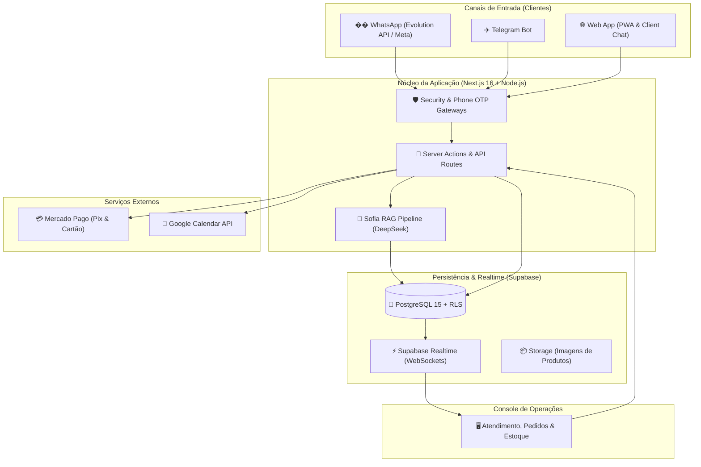

<div align="center">

# 🍖 CRM Sofia Manager 🔥
### *Plataforma Omnichannel de Atendimento Inteligente, Gestão de Pedidos e RAG para Assados de Domingo*

[](https://www.gnu.org/licenses/gpl-3.0)
[](https://nextjs.org/)
[](https://www.typescriptlang.org/)
[](https://supabase.com/)
[](https://tailwindcss.com/)
[](https://vitest.dev/)

---

[🇧🇷 Português](#-visão-geral-do-projeto-pt-br) • [🇪🇸 Español](#-visión-general-del-proyecto-es) • [Arquitetura](#-arquitetura-do-sistema) • [Instalação](#-instalação-e-configuração) • [Módulos](#-módulos-da-plataforma) • [Licença](#-licença)

---

</div>

---

# 🇧🇷 Visão Geral do Projeto (pt-BR)

O **CRM Sofia Manager** é uma solução completa desenvolvida para transformar a operação tradicional de assados de domingo (bairro Umbará, Curitiba/PR) em uma infraestrutura digital de alta performance, unificando:

1. **Atendimento Omnichannel Automatizado (WhatsApp, Telegram e Web Chat)** com a agente de IA **Sofía** (Chef Executivo e Mestre Assador com tom formal e reverente).
2. **Carrinho Interativo Sob Medida** que permite aos clientes montarem pedidos visualmente antes de dispará-los para a cozinha.
3. **Console de Atendimento em Tempo Real** para atendentes e supervisores com filas separadas (Fila IA / Fila Humana), alertas sonoros nativos via Web Audio API e indicadores de clientes em espera (+5 min).
4. **Gestão Transacional de Estoque Finito** com RPCs atômicas no PostgreSQL, garantindo que nenhum frango, costela ou maionese seja vendido além da capacidade das assadeiras, com estorno automático em caso de cancelamento.
5. **Pagamentos Integrados (Pix & Mercado Pago)** com conciliação automática via webhooks idempotentes.
6. **Agendamento Inteligente de Retirada e Delivery** sincronizado com o Google Calendar.

---

# 🇪🇸 Visión General del Proyecto (ES)

**CRM Sofia Manager** es una plataforma integral diseñada para resolver los cuellos de botella operativos en negocios de asados dominicales:

1. **Atención Omnicanal con IA Consultiva (WhatsApp, Telegram y Web)**: Respuestas instantáneas, entrega del menú en formato de tarjetas visuales enriquecidas y asistencia 24/7.
2. **Gestión de Pedidos en Tiempo Real**: Panel unificado para operadores con búsqueda multicriterio (cliente, teléfono, #PED, dirección y cortes del menú) y filtros avanzados (Pix, entrega, estados de pago).
3. **Control Transaccional de Stock**: Prevención de sobreventa mediante funciones almacenadas atómicas en PostgreSQL con restauración inmediata de inventario.
4. **Seguridad y Privacidad (LGPD)**: Políticas de seguridad a nivel de fila (RLS), autenticación OTP y validación estricta de números de teléfono (DDD 41 Curitiba).

---

## 🏛️ Arquitetura do Sistema



---

## 📦 Módulos da Plataforma

### 1. 🤖 Sofía IA — Chef Executivo & RAG Consultivo
- Consulta a base de conhecimento oficial de assados da casa (ingredientes, peso, rendimento por pessoa, tempo de forno).
- Entrega cartões visuais compatíveis com WhatsApp, Telegram e Web.
- Transbordo inteligente para operadores humanos sob demanda ou inatividade.

### 2. 💬 Console do Atendente (`/atendimento`)
- **Fila IA / Fila Humana / Fechadas** com contadores em tempo real.
- **Alertas Sonoros**: Chime suave de 2 tons sintetizado via Web Audio API (sem dependências de rede).
- **Badge de Espera**: Alerta visual em clientes sem resposta há mais de 5 minutos.
- **Gestão de Carrinho**: Operador pode montar ou editar o carrinho do cliente com 1 clique.

### 3. 📋 Gestão de Pedidos (`/atendimento/pedidos`)
- **Busca Multicampos**: Filtra por nome, telefone (com/sem máscara), número do pedido, endereço de entrega e produtos/cortes contidos no pedido.
- **Filtros Avançados**: Status do pedido, status de pagamento Pix, tipo de entrega (Delivery vs Balcão), período e ordenação por valor.
- **Ações Rápidas**: Confirmar preparo, marcar entregue, aprovar pagamento Pix e gerar links Mercado Pago.

### 4. 🥩 Estoque Transacional e Assadeiras (`/atendimento/produtos`)
- Ajustes rápidos de estoque com idempotência contra double-click.
- Cálculo de disponibilidade imediata versus pré-venda do domingo.

### 5. 🖼️ Reconciliação de Imagens no Storage (`/atendimento/admin`)
- Motor de varredura em 2 fases (*Dry-Run* $\rightarrow$ *Aprovação* $\rightarrow$ *Execução*) para limpeza segura de imagens órfãs no bucket sem risco de apagar fotos ativas.

---

## 🛠️ Stack Tecnológica

| Componente | Tecnologia | Propósito |
| :--- | :--- | :--- |
| **Framework Web** | Next.js 16.3 (Turbopack, App Router, Server Actions) | Frontend & Backend SSR/SSG |
| **Linguagem** | TypeScript 5.0 | Tipagem estrita de ponta a ponta |
| **Estilização** | Tailwind CSS 3.4 & Lucide Icons | Design system escuro, denso e responsivo |
| **Banco de Dados** | Supabase PostgreSQL 15 com RLS & RPCs | Persistência transacional e isolamento multilocatário |
| **Realtime** | Supabase Realtime | Atualização em tempo real de mensagens e pedidos |
| **Inteligência Artificial** | DeepSeek | Pipeline RAG com injeção dinâmica de estoque e cardápio |
| **WhatsApp Gateway** | Evolution API v2 | Comunicação com clientes via WhatsApp |
| **Pagamentos** | Mercado Pago SDK | Processamento de Pix instantâneo e Checkout Pro |
| **Agenda** | Google Calendar API v3 | Controle de capacidade e horários de retirada |
| **Testes** | Vitest & Playwright | Testes unitários, de integração e ponta a ponta (E2E) |

---

## 🚀 Instalação e Configuração

### Pré-requisitos
- **Node.js**: `v22.x` ou superior
- **Docker** e **Docker Compose**
- **Git**

### Passo a Passo

1. **Clonar o Repositório**:
   ```bash
   git clone https://github.com/wilkinbarban/CRM_Sofia_Manager.git
   cd CRM_Sofia_Manager
   ```

2. **Instalar Dependências**:
   ```bash
   npm ci
   ```

3. **Configurar as Variáveis de Ambiente**:
   ```bash
   cp .env.example .env
   # Edite o arquivo .env preenchendo suas credenciais locais ou de produção
   ```

4. **Subir os Serviços com Docker Compose**:
   ```bash
   docker compose up -d
   ```

5. **Executar a Aplicação em Modo de Desenvolvimento**:
   ```bash
   npm run dev
   ```
   Acesse a aplicação em [http://localhost:3000](http://localhost:3000).

---

## 🧪 Suíte de Testes (TDD & E2E)

O projeto possui cobertura rigorosa com **109 arquivos de teste** e mais de **620 asserções automatizadas**:

```bash
# Executar todos os testes unitários e de integração
npm test

# Executar testes em modo watch
npm run test:watch

# Executar testes ponta a ponta (E2E) com Playwright
npx playwright test
```

---

## 🔒 Segurança e Privacidade (LGPD)

- **Políticas RLS Rigorosas**: Nenhuma consulta ao banco de dados pode acessar pedidos ou perfis de outros usuários.
- **Validação Regional Curitiba**: Enforce a nível de banco de dados (`chk_telefone_curitiba`) para garantir números válidos com DDD 41 (`55419XXXXXXXX`).
- **Anonimização de Logs**: Os logs de auditoria e telemetria omitem informações sensíveis e PII dos clientes.
- **Zero Segredos no Repositório**: Todas as credenciais de API, tokens e chaves privadas são gerenciadas via variáveis de ambiente seguras.

---

## 📄 Licença

Este projeto está licenciado sob os termos da **GNU General Public License v3.0 (GPL-3.0)**. Consulte o arquivo [LICENSE](LICENSE) para obter mais informações.

---

<div align="center">
  <sub>Desenvolvido com excelência técnica para o CRM Sofia Manager — Umbará, Curitiba/PR.</sub>
</div>
