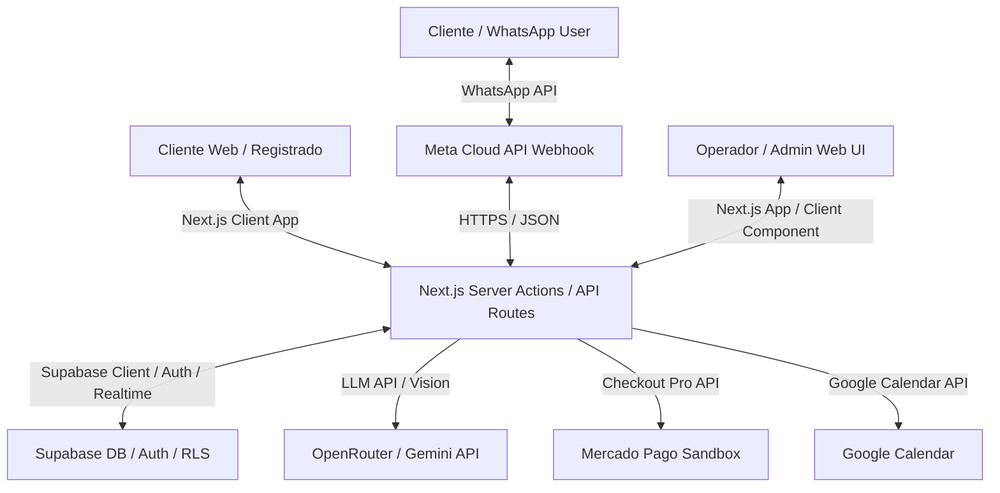

# Planejamento da Fase 0 — CRM Inteligente WhatsApp + IA "Sofía" (Asados)

Este documento detalha o design de arquitetura, modelo de dados, políticas de segurança (RLS), diretrizes de validação de dados, plano de implantação e backlog de tarefas para o projeto **Sofía (Asados)**. Conforme exigido pelo PRD, todas as tabelas e dados operacionais estão definidos em **Português do Brasil (pt-BR)**.

---

## 1. Arquitetura do Sistema

O sistema será construído usando uma arquitetura monolítica modular moderna com **Next.js 16** e **Supabase**.



### Detalhes das Integrações
*   **Interface Web (Next.js + Tailwind + shadcn/ui)**:
    *   **Portal do Cliente**: Área logada para clientes cadastrados (registro por e-mail com confirmação + verificação obrigatória de telefone via código WhatsApp). Permite bater papo direto com a Sofía via chat web, visualizar pedidos anteriores, ver o histórico de conversas e gerenciar sua conta (troca de senha e endereço).
    *   **Dashboard Admin/Operador**: Painel SPA completo para gerenciamento de conversas em tempo real. Inclui um **interruptor visual (toggle)** para ativar/desativar manualmente a IA em cada conversa.
*   **Next.js Server Actions / Route Handlers**: Processa a lógica de negócio, autentica requisições, gerencia a verificação de código por WhatsApp, executa a vinculação inteligente de contas e conecta-se a serviços externos.
*   **Supabase (BaaS)**: Gerencia o banco de dados PostgreSQL, autenticação de usuários, políticas RLS e conexões em tempo real.
*   **OpenRouter / Gemini API**: Executa a IA Sofía (atendimento) e tarefas de OCR de imagens.
*   **Mercado Pago (Sandbox)**: Geração de preferências de pagamento e webhooks de confirmação.
*   **Google Calendar**: Sincronização automática de pedidos confirmados no calendário do negócio.

---

## 2. Modelo de Dados (Supabase / PostgreSQL)

Todos os preços serão salvos em **centavos** (tipo `INTEGER`) para evitar erros de ponto flutuante. As tabelas, colunas e comentários estão em **Português do Brasil (pt-BR)**.

```sql
-- Habilitar extensão pgvector para busca semântica na base de conhecimento
CREATE EXTENSION IF NOT EXISTS vector;
```

### 2.1 Tabela `perfis` (Perfis de Usuários)
Estende o `auth.users` do Supabase. Todos os usuários registrados diretamente pelo site começam com a função de `cliente`.
```sql
CREATE TYPE tipo_funcao AS ENUM ('admin', 'supervisor', 'vendedor', 'cliente');

CREATE TABLE perfis (
    id UUID PRIMARY KEY REFERENCES auth.users(id) ON DELETE CASCADE,
    nome VARCHAR(100) NOT NULL,
    funcao tipo_funcao NOT NULL DEFAULT 'cliente',
    ativo BOOLEAN NOT NULL DEFAULT TRUE,
    data_criacao TIMESTAMP WITH TIME ZONE DEFAULT CURRENT_TIMESTAMP,
    data_atualizacao TIMESTAMP WITH TIME ZONE DEFAULT CURRENT_TIMESTAMP
);
```

### 2.2 Tabela `clientes` (CRM e Vínculo de Contatos)
Registra os clientes para o CRM. O telefone é **obrigatório** em todas as regras de negócio para permitir contato em caso de entregas.
```sql
CREATE TABLE clientes (
    id UUID PRIMARY KEY DEFAULT gen_random_uuid(),
    usuario_id UUID UNIQUE REFERENCES auth.users(id) ON DELETE SET NULL, -- Vínculo com usuário autenticado web (só após verificação de telefone)
    nome VARCHAR(100) NOT NULL,
    telefone VARCHAR(20) UNIQUE NOT NULL, -- Obrigatório para cadastro web e WhatsApp
    endereco TEXT, -- Endereço do cliente para entregas
    tags TEXT[] DEFAULT '{}',
    score INTEGER DEFAULT 0, -- Score de engajamento/vendas
    notas TEXT,
    data_criacao TIMESTAMP WITH TIME ZONE DEFAULT CURRENT_TIMESTAMP,
    data_atualizacao TIMESTAMP WITH TIME ZONE DEFAULT CURRENT_TIMESTAMP,
    
    -- Restrição a nível de banco de dados (Regra: telefone brasileiro com DDD 41 de Curitiba obrigatório)
    -- Formato internacional completo: 55419XXXXXXXX (13 dígitos)
    CONSTRAINT chk_telefone_curitiba CHECK (telefone ~ '^55419[0-9]{8}$')
);
```

### 2.3 Tabela `codigos_verificacao` (Verificação de Telefone via WhatsApp OTP)
Armazena temporariamente os códigos enviados por WhatsApp para validação de identidade antes do registro/login completo no site.
```sql
CREATE TABLE codigos_verificacao (
    id UUID PRIMARY KEY DEFAULT gen_random_uuid(),
    usuario_id UUID REFERENCES auth.users(id) ON DELETE CASCADE,
    telefone VARCHAR(20) NOT NULL,
    codigo VARCHAR(6) NOT NULL,
    expira_em TIMESTAMP WITH TIME ZONE NOT NULL,
    verificado BOOLEAN NOT NULL DEFAULT FALSE,
    data_criacao TIMESTAMP WITH TIME ZONE DEFAULT CURRENT_TIMESTAMP,
    
    -- Validação do DDD 41 também na geração do código de validação
    CONSTRAINT chk_otp_telefone_curitiba CHECK (telefone ~ '^55419[0-9]{8}$')
);
```

### 2.4 Tabela `conversas` (Sessões de Chat)
```sql
CREATE TYPE status_conversa AS ENUM ('aberta', 'pendente', 'fechada');

CREATE TABLE conversas (
    id UUID PRIMARY KEY DEFAULT gen_random_uuid(),
    cliente_id UUID NOT NULL REFERENCES clientes(id) ON DELETE CASCADE,
    atribuido_a UUID REFERENCES perfis(id) ON DELETE SET NULL,
    status status_conversa NOT NULL DEFAULT 'aberta',
    ia_ativa BOOLEAN NOT NULL DEFAULT TRUE, -- Interruptor para ligar/desligar a Sofía nesta conversa
    ultima_mensagem_em TIMESTAMP WITH TIME ZONE DEFAULT CURRENT_TIMESTAMP,
    data_criacao TIMESTAMP WITH TIME ZONE DEFAULT CURRENT_TIMESTAMP,
    data_atualizacao TIMESTAMP WITH TIME ZONE DEFAULT CURRENT_TIMESTAMP
);
```

### 2.5 Tabela `mensagens` (Histórico de Mensagens)
```sql
CREATE TYPE remetente_mensagem AS ENUM ('cliente', 'vendedor', 'ia', 'sistema');
CREATE TYPE tipo_mensagem AS ENUM ('texto', 'imagem', 'audio', 'documento');

CREATE TABLE mensagens (
    id UUID PRIMARY KEY DEFAULT gen_random_uuid(),
    conversa_id UUID NOT NULL REFERENCES conversas(id) ON DELETE CASCADE,
    remetente remetente_mensagem NOT NULL,
    tipo tipo_mensagem NOT NULL DEFAULT 'texto',
    conteudo TEXT NOT NULL,
    url_anexo TEXT, -- Caminho no Supabase Storage para mídias
    data_criacao TIMESTAMP WITH TIME ZONE DEFAULT CURRENT_TIMESTAMP
);
```

### 2.6 Tabela `produtos` (Catálogo de Produtos)
```sql
CREATE TABLE produtos (
    id UUID PRIMARY KEY DEFAULT gen_random_uuid(),
    nome VARCHAR(100) NOT NULL,
    descricao TEXT,
    preco_centavos INTEGER NOT NULL, -- Ex: R$ 45,00 = 4500
    ativo BOOLEAN NOT NULL DEFAULT TRUE,
    url_imagem TEXT,
    data_criacao TIMESTAMP WITH TIME ZONE DEFAULT CURRENT_TIMESTAMP,
    data_atualizacao TIMESTAMP WITH TIME ZONE DEFAULT CURRENT_TIMESTAMP
);
```

### 2.7 Tabela `pedidos` (Pedidos de Vendas)
```sql
CREATE TYPE status_pedido AS ENUM ('novo', 'confirmado', 'entregue', 'cancelado');
CREATE TYPE tipo_entrega AS ENUM ('entrega', 'retirada');
CREATE TYPE status_pagamento AS ENUM ('pendente', 'aprovado', 'rejeitado', 'reembolsado');
CREATE TYPE meio_pagamento AS ENUM ('pix', 'cartao_credito', 'cartao_debito', 'dinheiro');

CREATE TABLE pedidos (
    id UUID PRIMARY KEY DEFAULT gen_random_uuid(),
    cliente_id UUID NOT NULL REFERENCES clientes(id) ON DELETE RESTRICT,
    conversa_id UUID REFERENCES conversas(id) ON DELETE SET NULL,
    status status_pedido NOT NULL DEFAULT 'novo',
    tipo_entrega tipo_entrega NOT NULL DEFAULT 'retirada',
    endereco_entrega TEXT, -- Caso seja entrega, se omitido puxará o 'endereco' de 'clientes'
    taxa_entrega_centavos INTEGER DEFAULT 0, -- Combinada com o cliente
    total_produtos_centavos INTEGER NOT NULL,
    total_pedido_centavos INTEGER NOT NULL, -- total_produtos + taxa_entrega
    status_pagamento status_pagamento NOT NULL DEFAULT 'pendente',
    meio_pagamento meio_pagamento NOT NULL,
    mercado_pago_preferencia_id VARCHAR(100),
    google_event_id VARCHAR(100), -- ID do evento no calendário para sincronização e atualizações
    data_criacao TIMESTAMP WITH TIME ZONE DEFAULT CURRENT_TIMESTAMP,
    data_atualizacao TIMESTAMP WITH TIME ZONE DEFAULT CURRENT_TIMESTAMP
);
```

---

## 3. Diretrizes de Segurança, LGPD e Privacidade de Dados

O projeto obedece aos regulamentos da **LGPD (Lei Geral de Proteção de Dados)** e padrões de conformidade PCI-DSS para o processamento de pagamentos.

### 3.1 Práticas Recomendadas de Validação de Input
Todo e qualquer input vindo do cliente ou operador será sanitizado e validado rigorosamente na borda da aplicação (via schemas **Zod** no Next.js) e no banco de dados.

*   **Validação de E-mail**:
    *   Formato rígido baseado na especificação RFC 5322.
    *   Regex Zod recomendado: `/^[a-zA-Z0-9._%+-]+@[a-zA-Z0-9.-]+\.[a-zA-Z]{2,}$/`.
*   **Validação de Telefone (Foco Curitiba - DDD 41)**:
    *   O número de telefone deve ser formatado para o padrão internacional do Brasil.
    *   Formato aceito: `55419XXXXXXXX` (55 = DDI Brasil, 41 = DDD Curitiba, 9 = Prefixo Celular, seguido por 8 dígitos).
    *   No frontend, o usuário verá máscaras de digitação amigáveis como `(41) 9XXXX-XXXX`, mas a sanitização extrairá todos os caracteres não numéricos antes de salvar no banco de dados e processar o envio de OTP.

### 3.2 Privacidade dos Dados (LGPD)
*   **Coleta Mínima (Minimização de Dados)**: Apenas coletamos nome, e-mail, telefone e endereço necessários para processar o pedido e realizar a entrega no município de Curitiba.
*   **Logs Limpos (Sem PII)**: Os logs na tabela `logs_atividade` e logs de servidor nunca conterão informações pessoais identificáveis brutas (como senhas, tokens de pagamento ou o texto bruto de chaves privadas).
*   **Eliminação de Dados**: Funcionalidade embutida na tela de controle do Admin para excluir perfis de clientes quando solicitado (direito ao esquecimento), garantindo a integridade referencial dos pedidos no banco (pedidos anteriores não são excluídos, mas perdem a associação nominal do cliente, marcando como "Cliente Excluído").

### 3.3 Segurança dos Pagamentos Online (Mercado Pago)
*   **Sem dados de cartão no servidor**: Ao utilizar o **Mercado Pago Checkout Pro**, nenhum dado financeiro ou de cartão de crédito do cliente toca nossa infraestrutura ou banco de dados. O processamento ocorre diretamente nos servidores do Mercado Pago certificados com PCI-DSS Nível 1.
*   **Webhook Seguro**: Nosso endpoint de webhook validará a assinatura das notificações do Mercado Pago.

---

## 4. Segurança e Regras RLS (Row Level Security)

O acesso às tabelas é restrito através do Supabase Auth e políticas RLS detalhadas.

### Matriz de Permissões por Função
| Tabela | Admin | Supervisor | Vendedor / Atendente | Cliente (Usuário Comum) | Anon (Webhooks/Público) |
|---|---|---|---|---|---|
| **perfis** | CRUD | R (Geral) | R (Geral) | RU (Apenas o seu próprio) | Nenhuma |
| **clientes** | CRUD | CRUD | CRUD | RU (Apenas o seu próprio) | Nenhuma |
| **conversas** | CRUD | CRUD | CRUD | RU (Apenas as suas) | Escrita (WhatsApp Webhook) |
| **mensagens**| CRUD | CRUD | CRUD | RU (Apenas as suas) | Escrita (WhatsApp Webhook) |
| **produtos** | CRUD | R | R | R (Público) | R (Público) |
| **pedidos** | CRUD | CRUD | CRUD | R (Apenas os seus) | Escrita (Webhook Mercado Pago) |
| **itens_pedido** | CRUD | CRUD | CRUD | R (Apenas os seus) | Nenhuma |
| **base_conhecimento** | CRUD | R | R | Nenhuma | Nenhuma |
| **configuracoes** | CRUD | R | R | Nenhuma | Nenhuma |
| **logs_atividade** | R (Não editável) | R (Não editável) | Nenhuma | Nenhuma | Nenhuma |

---

## 5. Lógica de Vinculação Inteligente com Validação WhatsApp (OTP)

Para garantir que o número de telefone informado pertence realmente ao cliente cadastrado na web, implementamos a verificação obrigatória via WhatsApp antes da liberação e fusão da conta.

```text
Nota: O registro via WhatsApp continua sendo automático no momento em que o cliente envia uma mensagem para o número da churrascaria, sem necessidade de OTP.
```

### Fluxo de Registro e Verificação
```mermaid
sequenceDiagram
    actor C as Cliente Web
    participant App as Backend Next.js
    participant Meta as WhatsApp API
    participant DB as Supabase DB
    
    C->>App: Registra com E-mail + Senha
    App->>DB: Cria conta no Auth (Pendente verificação de E-mail)
    Note over C, DB: Confirmação do e-mail realizada
    C->>App: Efetua login & digita número de telefone (com DDI 55 e DDD 41 obrigatório)
    App->>DB: Gera código OTP (6 dígitos) e salva em 'codigos_verificacao'
    App->>Meta: Envia mensagem de WhatsApp com o código OTP
    Note over C, Meta: O cliente recebe o código no celular via WhatsApp
    C->>App: Insere o código OTP na tela de verificação
    App->>DB: Compara código e expiração em 'codigos_verificacao'
    
    alt Código Válido & Telefone já existe no DB (cliente vindo do WhatsApp)
        App->>DB: Atualiza 'clientes' existente: define 'usuario_id = auth.uid()' e 'endereco' (se informado)
        App->>DB: Remove qualquer registro de cliente temporário duplicado sem telefone
        App->>DB: Marca código como verificado
        App->>C: Libera acesso total e mostra histórico unificado de WhatsApp e Pedidos!
    alt Código Válido & Telefone NÃO existe no DB (novo cliente completo)
        App->>DB: Cria registro em 'clientes' vinculando 'usuario_id = auth.uid()' e gravando o telefone e endereço
        App->>DB: Marca código como verificado
        App->>C: Libera acesso total ao portal
    alt Código Inválido ou Expirado
        App->>C: Exibe mensagem de erro e bloqueia acesso até verificação com sucesso
    end
```

---

## 6. Plano de IA (Sofía)

### 6.1 Prompt Máster (pt-BR)
O prompt máster definirá as regras estritas da assistente Sofía:

```text
Você é a Sofía, a atendente inteligente da churrascaria "Asados". Seu tom de voz deve ser formal, extremamente amigável, prestativo e humanizado. Responda sempre em Português do Brasil (pt-BR). Use emojis de forma moderada para tornar o atendimento caloroso. Suas respostas devem ser curtas, claras e diretas.

Regras de Operação:
1. Cardápio Oficial:
   - Frango Assado
   - Carne de Porco Assada
   - Costela de Porco Assada
   - Costela de Boi Assada
   - Linguiça Assada
   - Acompanhamentos: Bebidas e Refrigerantes.
2. Horário de funcionamento: Sábados e domingos, das 10h às 14h. Não abrimos nos dias de semana. Não é possível consumir no local (apenas retirada ou entrega).
3. Entregas: Apenas na cidade de Curitiba. A taxa de entrega deve ser combinada/negociada com a equipe humana.
4. Pagamentos aceitos: PIX, cartões de crédito/débito e dinheiro (com o entregador).
5. Transbordo (Handoff) Humano: Transfira a conversa imediatamente para um atendente humano se:
   - O cliente solicitar falar com um humano.
   - For necessário negociar a taxa de entrega.
   - O cliente tiver alguma dúvida fora do contexto da base de conhecimento.
   - Houver alguma reclamação ou problema com um pedido.
   
Responda usando APENAS as informações contidas no contexto fornecido. Se você não souber a resposta, peça desculpas educadamente e transfira o atendimento para um humano. Nunca invente dados.
```

---

## 7. Plano de Implantação (VPS Ubuntu & Docker)

Esta seção especifica a infraestrutura de implantação usando Docker para isolamento e Nginx como proxy reverso com suporte a SSL.

### 7.1 Docker Compose (`docker-compose.yml`)
Configuração recomendada para o ambiente de produção na VPS:

```yaml
version: '3.8'

services:
  app:
    build:
      context: .
      dockerfile: Dockerfile
    container_name: asados-crm
    restart: always
    ports:
      - "3000:3000"
    environment:
      - NODE_ENV=production
      - NEXT_PUBLIC_SUPABASE_URL=${NEXT_PUBLIC_SUPABASE_URL}
      - NEXT_PUBLIC_SUPABASE_ANON_KEY=${NEXT_PUBLIC_SUPABASE_ANON_KEY}
      - SUPABASE_SERVICE_ROLE_KEY=${SUPABASE_SERVICE_ROLE_KEY}
      - OPENROUTER_API_KEY=${OPENROUTER_API_KEY}
      - WHATSAPP_ACCESS_TOKEN=${WHATSAPP_ACCESS_TOKEN}
      - WHATSAPP_PHONE_NUMBER_ID=${WHATSAPP_PHONE_NUMBER_ID}
      - WHATSAPP_VERIFY_TOKEN=${WHATSAPP_VERIFY_TOKEN}
      - MERCADO_PAGO_ACCESS_TOKEN=${MERCADO_PAGO_ACCESS_TOKEN}
      - GOOGLE_CALENDAR_ID=${GOOGLE_CALENDAR_ID}
      - GOOGLE_CLIENT_EMAIL=${GOOGLE_CLIENT_EMAIL}
      - GOOGLE_PRIVATE_KEY=${GOOGLE_PRIVATE_KEY}
    depends_on:
      - redis

  redis:
    image: redis:alpine
    container_name: asados-redis
    restart: always
    volumes:
      - redis_data:/data

  nginx:
    image: nginx:alpine
    container_name: asados-nginx
    restart: always
    ports:
      - "80:80"
      - "443:443"
    volumes:
      - ./nginx.conf:/etc/nginx/nginx.conf:ro
      - /etc/letsencrypt:/etc/letsencrypt:ro
    depends_on:
      - app

volumes:
  redis_data:
```

(Nota histórica: o arquivo `nginx.conf` foi removido deste repositório; o ingress ativo é o `portfolio-nginx` do projeto Portafolio, conforme `docs/runbooks/domain-deployment.md`.)

### 7.2 Estratégia de Backups do Banco de Dados
*   **Cloud Backup**: Configuração de rotinas automáticas de snapshot no painel do Supabase.
*   **Backup Físico VPS**: Cron job configurado para executar `supabase db dump` diariamente, gerando arquivos SQL compactados salvos em volume de disco isolado na VPS.

---

## 8. Backlog de Tarefas (SDD-ready)

### Épica 1: Infraestrutura, Autenticação, Validação de Telefone e Portal do Cliente (M1 + Setup)
*   [ ] **E1.T1**: Inicializar o projeto Next.js 16 e shadcn/ui.
*   [ ] **E1.T2**: Configurar Supabase Local com CLI, criar schemas SQL com tipos, enums, tabelas, RLS, restrição de DDD 41 (chk_telefone_curitiba) e o campo `endereco` em `clientes`.
*   [ ] **E1.T3**: Implementar tela de Registro de Clientes no portal web pedindo E-mail e Senha (com validação de input Zod para e-mail), com validação Supabase Auth.
*   [ ] **E1.T4**: Criar tela de bloqueio e formulário para inserção do telefone do cliente com máscara e sanitização restrita a `55419XXXXXXXX`.
*   [ ] **E1.T5**: Desenvolver o serviço de backend que gera o código OTP de 6 dígitos, grava em `codigos_verificacao` e dispara a mensagem de validação no WhatsApp do cliente usando a API de saída (outbound) da Meta.
*   [ ] **E1.T6**: Desenvolver a tela para digitação do código OTP recebido e a Server Action que valida o código contra o banco de dados.
*   [ ] **E1.T7**: Implementar a lógica de vinculação inteligente (fusão/merge) de contas somente após a validação bem-sucedida do código OTP do WhatsApp.
*   [ ] **E1.T8**: Criar tela de "Perfil e Configurações" no Portal do Cliente, permitindo que ele altere seu nome, senha, endereço (`endereco`) e altere seu telefone (exigindo um novo código OTP via WhatsApp antes de confirmar a alteração de número).
*   [ ] **E1.T9**: Criar middleware de proteção de rotas por papel (`admin`, `supervisor`, `vendedor`, `cliente`) bloqueando clientes não-verificados no telefone.
*   [ ] **E1.T10**: Desenvolver o script de banco (seeding) com os operadores internos (`admin`, `supervisor`, `vendedor`).

### Épica 2: Portal de Chat do Cliente Web & Histórico (M3 + RLS)
*   [ ] **E2.T1**: Criar a interface Web do Cliente (página limpa com chat e histórico unificado).
*   [ ] **E2.T2**: Implementar o chat em tempo real do cliente com a IA "Sofía" (via web socket/Supabase Realtime).
*   [ ] **E2.T3**: Criar aba "Meus Pedidos" para o cliente logado ver o andamento e históricos de suas compras (tanto as feitas via WhatsApp quanto pela Web).
*   [ ] **E2.T4**: Garantir que as políticas RLS impeçam um cliente de ler chats e pedidos de outros.

### Épica 3: Integração WhatsApp & Webhooks (M2 + M3)
*   [ ] **E3.T1**: Implementar endpoint de verificação do Webhook da Meta API.
*   [ ] **E3.T2**: Desenvolver o tratador de Webhook para receber mensagens (texto, áudio, imagens), normalizá-las e salvá-las nas tabelas `conversas` e `mensagens`.
*   [ ] **E3.T3**: Criar fila em memória/Redis para processar mensagens de forma idempotente.
*   [ ] **E3.T4**: Desenvolver o serviço de envio de mensagens de saída (outbound) usando a Meta Cloud API.

### Épica 5: Treinamento e IA Sofía (M4 + M9 RAG)
*   [ ] **E5.T1**: Desenvolver a integração do OpenRouter com o modelo LLM configurado.
*   [ ] **E5.T2**: Implementar busca vetorial no Supabase (`base_conhecimento` via pgvector).
*   [ ] **E5.T3**: Criar pipelines de ingestão de conhecimento no Admin Dashboard (parsing de sites, upload de arquivos .txt).
*   [ ] **E5.T4**: Implementar fluxo de OCR de imagens (Gemini Vision via OpenRouter) para extrair dados de fotos enviadas pelo Admin.
*   [ ] **E5.T5**: Implementar regras de Handoff Humano automático (quando a conversa de WhatsApp ou Web desativa a IA baseado nas mensagens do cliente).

### Épica 4: Bandeja de Entrada Web Realtime do Operador (M3)
*   [ ] **E4.T1**: Criar layout principal de Inbox estilo Intercom com lista de conversas ativas.
*   [ ] **E4.T2**: Implementar visualização da conversa ativa com mensagens realtime (Supabase Realtime) e notas internas.
*   [ ] **E4.T3**: **Adicionar o componente interruptor (toggle Switch)** visual no chat para habilitar/desabilitar a IA (`ia_ativa`) na conversa, operável por vendedores, supervisores e admins.
*   [ ] **E4.T4**: Implementar ações de atendente: responder, atribuir/transferir conversa e fechar/reabrir atendimento.
*   [ ] **E4.T5**: Criar filtros de pesquisa na bandeja (por atendente, por tags e status da conversa).

### Épica 6: CRM, Vendas, Pedidos e Google Calendar (M5 + M6 + M7 + M8)
*   [ ] **E6.T1**: Criar visualização da Ficha do Cliente com tags, notas de atendimento, endereço cadastrado e histórico no painel lateral do chat.
*   [ ] **E6.T2**: Desenvolver o formulário rápido para criar Pedido diretamente a partir do chat (seleção de produtos, quantidade, tipo de entrega, taxa de entrega manual e endereço, puxando o endereço cadastrado do cliente como padrão).
*   [ ] **E6.T3**: Implementar a API do Google Calendar no Next.js usando autenticação de Service Account.
*   [ ] **E6.T4**: Criar a automação que insere no Google Calendar o pedido assim que é confirmado (com horário, detalhes dos produtos, dados do cliente e endereço de entrega/retirada).
*   [ ] **E6.T5**: Criar tabelas e visualização simples do Pipeline de Vendas (etapas de oportunidade).
*   [ ] **E6.T6**: Implementar CRUD de produtos no catálogo para uso dos atendentes e bot.

### Épica 7: Integração de Pagamento Mercado Pago Sandbox (M9)
*   [ ] **E7.T1**: Configurar a SDK do Mercado Pago no Next.js com credenciais de Sandbox.
*   [ ] **E7.T2**: Implementar a ação que gera a *Preferencia de Pago* (Checkout Pro) para o pedido e retorna o link para o chat/portal.
*   [ ] **E7.T3**: Desenvolver o endpoint de Webhook (IPN/Notification) para receber a confirmação de pagamento do Mercado Pago e atualizar o status em Supabase (e atualizar/marcar o evento no Google Calendar como Pago).

### Épica 8: Dashboard Admin, Gestão de Operadores e Auditoria (M9 + M10)
*   [ ] **E8.T1**: Desenvolver telas de gerenciamento de prompts da IA (versões, master prompt, rollback).
*   [ ] **E8.T2**: Implementar painel de gerenciamento de Usuários e Operadores (listar todos, mudar ativação/acesso e alterar cargo: `admin`, `supervisor`, `vendedor`, `cliente`).
*   [ ] **E8.T3**: Criar painel para configurar e testar a conexão com o Google Calendar (Calendar ID e credenciais JSON).
*   [ ] **E8.T4**: Implementar painel para gerenciar e rotacionar chaves de APIs seguras.
*   [ ] **E8.T5**: Desenvolver painel de logs de auditoria dos administradores e estatísticas de uso da IA vs humano.

---

## 9. Fases Posteriores ao Desenvolvimento (Pós-Desenvolvimento)

Uma vez concluído o desenvolvimento do backlog das Épicas (1 a 8), o ciclo de vida do projeto seguirá o seguinte cronograma de homologação e lançamento:

### 9.1 Fase A: Homologação e Testes de Qualidade (QA & UAT)
1. **Testes de Integração de Pagamento (Mercado Pago)**: Validação das transações usando cartões de teste em ambiente Sandbox, garantindo o processamento correto de webhooks e a liberação imediata do status do pedido no Supabase.
2. **Homologação da IA Sofía**: Simulação de cenários de atendimento via WhatsApp e chat web com perguntas fora de contexto, solicitações de entrega fora de Curitiba e tentativas de negociação de taxas, validando a assertividade do bot e o disparo do handoff humano.
3. **Validação de Fusão de Contas**: Registro de novos usuários com números de celular já ativos no WhatsApp do negócio para auditar o comportamento da transação de merge de dados e histórico de conversas/pedidos.

### 9.2 Fase B: Implantação e Entrada em Produção (Go-Live)
1. **Configuração de VPS**: Subida dos containers Docker (Next.js, Redis, Nginx) no servidor de produção, instalação e renovação automática de certificados SSL/TLS via Let's Encrypt (Certbot) para conexões seguras HTTPS.
2. **Migração de Banco de Dados**: Execução do deploy final do schema SQL do Supabase local para o projeto cloud oficial de produção (`xvzdxoktwnzmxsfizkxo`), incluindo o seeding inicial de perfis internos (`admin`, `supervisor`, `vendedor`).
3. **Troca de Credenciais para Produção**:
   - Substituição das chaves de API Sandbox do Mercado Pago pelas credenciais de produção.
   - Ativação do número oficial de WhatsApp da churrascaria na API do Meta Cloud e aprovação das primeiras mensagens de modelo.

### 9.3 Fase C: Operação, Monitoramento e Melhoria Contínua
1. **Treinamento e Ativação dos Operadores**: Distribuição de credenciais temporárias para vendedores/supervisores e realização do primeiro login com redefinição de senha obrigatória.
2. **Auditoria de Conversas e Ajuste Fino**: Acompanhamento diário das interações de Sofía para calibragem do Master Prompt e inserção de novas respostas na base de conhecimento.
3. **Ciclo de Aprendizado (Engram)**: Revisão semanal pelo Supervisor de conversas avaliadas com feedback negativo para incorporação de novas perguntas e respostas de políticas internas do negócio.


---

## 10. Relatório de Análise e Melhorias de Arquitetura (LGPD & Produção)

Após uma revisão completa do PRD e das regras de negócio, identificamos as seguintes melhorias técnicas para garantir a estabilidade do sistema em ambiente de produção:

### 10.1 Deduplicação de Mensagens (Idempotência)
*   **Problema**: A API do WhatsApp frequentemente reenvia webhooks em caso de latência (retries), gerando mensagens duplicadas no banco de dados e no chat.
*   **Melhoria**: Adicionar a coluna `whatsapp_mensagem_id VARCHAR(100) UNIQUE` na tabela `mensagens`. No webhook do Next.js, usamos um `INSERT ON CONFLICT DO NOTHING` para garantir que cada mensagem seja processada e respondida exatamente uma única vez.

### 10.2 Ingestão de Mídias do WhatsApp
*   **Problema**: Mensagens de áudio, imagens ou documentos enviados pelo WhatsApp vêm como um `media_id` temporário da Meta.
*   **Melhoria**: Criar o bucket `chat-midias` no Supabase Storage. O webhook do Next.js fará o download da mídia usando a API da Meta, fará o upload para o Supabase Storage e salvará o link público em `mensagens.url_anexo`.

### 10.3 Supabase Storage Buckets
Necessitamos configurar as políticas de acesso e segurança (RLS) para dois buckets de armazenamento no Supabase:
1.  `produtos-imagens`: Bucket público. Qualquer usuário pode ler as fotos dos pratos. Apenas Admins podem fazer upload.
2.  `chat-midias`: Bucket privado com RLS. Apenas operadores e o cliente proprietário do chat correspondente podem ler os arquivos anexos.

### 10.4 Resiliência na Integração com o Google Calendar
*   **Problema**: Se a API do Google Calendar sofrer instabilidade ou as credenciais expirarem, o fluxo de criação de pedidos no Next.js pode travar (erro 500).
*   **Melhoria**: Implementar o salvamento e confirmação do pedido no banco de dados de forma assíncrona ou com tratamento de exceções (try/catch robusto). Se o Google Calendar falhar, o pedido é criado com sucesso, salvando uma flag `sincronizacao_pendente = true` para reprocessamento posterior via fila em segundo plano.

### 10.5 Sincronização de Sessão de Cookies (Next.js SSR)
Para garantir que a validação de rotas pelo middleware e o carregamento do portal do cliente sejam seguros, usaremos `@supabase/ssr` para sincronizar automaticamente as sessões e tokens JWT do Supabase via cookies seguros em Server Components, Server Actions e API Routes.
